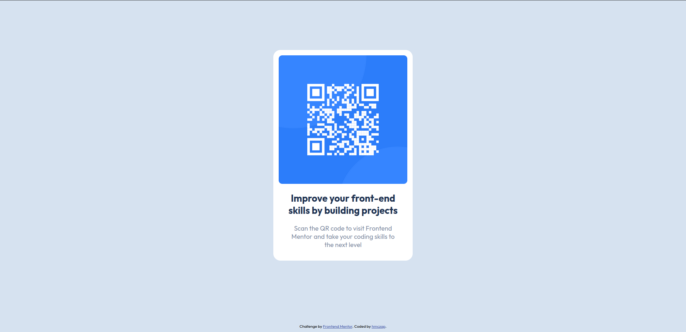

# Frontend Mentor - QR code component

This is a solution to the [QR code component challenge on Frontend Mentor](https://www.frontendmentor.io/challenges/qr-code-component-iux_sIO_H).

## Table of contents

- [Overview](#overview)
  - [Screenshot](#screenshot)
  - [Links](#links)
- [Author](#author)

## Overview

### Screenshot

### Links

- Solution URL: [here](https://github.com/hmczap/QR-Component
- Live Site URL: [here](https://hmczap.github.io/QR-Component/)

## Author

- Frontend Mentor - [@hmczap](https://www.frontendmentor.io/profile/hmczap)

